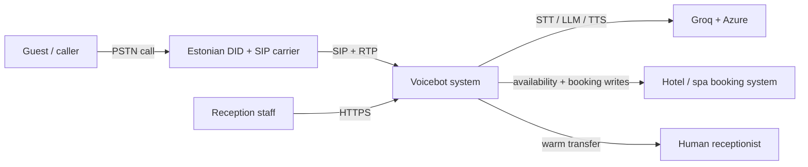
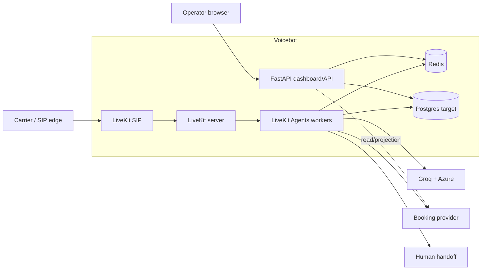

# Estonian hotel and spa voicebot — architecture

Status: **v1.0 truth-first architecture, updated 2026-10-01**.

This document separates what is running from what is planned. A component is
not “ready” because credentials exist or a container starts; it is ready only
after its real workflow passes end-to-end verification.

Historical vendor/model research from the earlier draft is summarized in
[`docs/research/stack-research-2026-09-29.md`](docs/research/stack-research-2026-09-29.md).

## 1. Goal and non-negotiable invariants

The product is an inbound Estonian-language telephone receptionist for hotels
and spas. It must answer routine questions, check live availability, complete
safe bookings, and transfer exceptional cases to a human with context.

Non-negotiable invariants:

1. **No false readiness.** Configured, reachable, and operational are separate
   states.
2. **No invented availability or prices.** Booking systems are the only source
   of inventory and price truth.
3. **No double booking.** Confirmation rechecks provider truth and uses
   idempotency.
4. **No cross-call state.** Every caller has an isolated room, agent session,
   conversation, and booking context.
5. **No dead-end automation.** Unsupported, overloaded, or uncertain workflows
   transfer or fail closed rather than pretending to succeed.
6. **No card data in voice or logs.** Payments use provider-hosted links or
   tokenized flows.
7. **No secrets in source or logs.** Provider credentials live in runtime
   environment storage only.

## 2. Verified as-built status

| Component | Actual state | Operational gate |
| --- | --- | --- |
| Operator web/API | Deployed at `robot.arleserver.cfd`; health endpoint and dashboard work | Healthy production container |
| HTTP voice turn | `POST /api/turn` performs Groq STT/chat and Azure TTS; text and audio paths verified | Working, but not a telephone media loop |
| LLM | Groq `openai/gpt-oss-20b` works, including tool calls | Primary only; no configured secondary |
| Speech | Groq Whisper and Azure `et-EE-AnuNeural` work | Non-streaming HTTP clients |
| FAQ | SQLite FTS repository is thread-safe, but generic demo policies are always seeded and advertised | Not property-approved; block live answers |
| Call log | SQLite masks only peer IDs; complete heard/reply summaries are stored and publicly readable at `/api/calls` | P0 privacy blocker |
| Dashboard commands | Demo queue; writes fail closed outside demo | Not connected to booking-provider commands |
| LiveKit server | Operator-managed LiveKit, SIP, and Redis containers were runtime-verified on the host, but their manifests/config live outside this repository | Internal only; not repo-reproducible (R-017) |
| Public telephone ingress | Carrier account/number is pending; no public SIP/RTP ports, trunk, or dispatch rule | Not operational |
| Continuous call agent | No LiveKit Agents worker; `app/pipeline.py` is a descriptor skeleton | Not implemented |
| Hotel booking | Apaleo, Mews, Cloudbeds, and QloApps drivers are stubs | No operational `StayAdapter` |
| Spa booking | Private Easy!Appointments 1.6.0 installed; real HTTP catalogue/search/hold/confirm/cancel and synthetic race/recovery tests pass | Explicit demo-write opt-in; not real-property or independent-writer readiness |
| Persistent booking state | Easy customer/appointment outcomes persist in SQLite on `/data`; file lock coordinates the single-host writer; hold/search snapshots remain in memory | Outcome replay survives restart; holds do not; no distributed/caller-owned state |
| Concurrency | [Three concurrent production HTTP turns](docs/evidence/2026-09-30-http-concurrency-smoke.md) passed; this is diagnostic HTTP only | Phone concurrency blocked (Q-01/Q-07) |

`/api/status` currently reports wiring and derived capabilities. In particular,
`livekit: true` means credentials are configured; it does **not** mean a phone
call can reach an agent. `serving_demo_data: true` remains intentional until
real operator and booking data replace the demo store.

Live traffic is blocked by the P0/P1 items in
[`docs/architecture/risk-register.md`](docs/architecture/risk-register.md).
The public call-summary exposure is verified on the deployed site, not merely a
theoretical code finding.

## 3. Target topology

### System context



### Container view



```text
Telephone/media plane

Caller
  -> Estonian DID and carrier channels
  -> public SIP edge / overflow policy
  -> self-hosted LiveKit SIP
  -> individual dispatch rule: call-<random>
  -> LiveKit room
  -> LiveKit Agents worker (one isolated job process per call)
       -> Groq STT
       -> Groq LLM + guarded tools
       -> Azure Estonian TTS
       -> StayAdapter / SlotAdapter

Control/data plane

Operator browser
  -> FastAPI dashboard/API
       -> Postgres: durable call/booking events
       -> Redis: holds, idempotency, admission, provider rate budgets
       -> booking providers: final inventory and booking truth
```

The web/API container is not in the real-time media path. It serves the
operator UI, configuration-safe status, and internal event/command endpoints.
The call worker is deployed separately and scales independently.

## 4. Provisional real-time framework: LiveKit Agents

The provisional choice is **LiveKit Agents** as the only call runtime. Do not
put Pipecat and LiveKit Agents in the same production call path unless a spike
proves a named LiveKit capability gap.

Why:

- SIP dispatch already creates and assigns LiveKit rooms.
- `AgentServer` provides job assignment, process-per-call isolation, load
  admission, draining, and horizontal worker balancing.
- `AgentSession` provides turn detection, interruptions, STT/LLM/TTS plumbing,
  and function tools.
- Official plugins cover Groq STT/LLM, Azure Speech TTS, and Silero VAD.
- A second orchestration framework would duplicate lifecycle, buffering,
  endpointing, and failure handling.

The existing `run_turn` HTTP path remains a diagnostic and browser-test path.
The worker should reuse booking validation, FAQ retrieval, PII masking,
idempotency rules, and the price guard—not duplicate business policy.

When the worker lands, remove Pipecat from the active dependency plan and
replace the descriptor-only `app/pipeline.py` with the real LiveKit session
configuration.

This is not an accepted implementation decision yet. Before pinning packages,
a time-boxed spike must prove:

1. inbound SIP or loopback room dispatch to one job per call;
2. two simultaneous isolated calls;
3. Estonian Groq STT + Azure Anu output and measured first-audio latency;
4. barge-in/endpointing behavior on Estonian names, dates, and prices;
5. forced 429/TTS-failure behavior with audible fallback;
6. graceful drain and an explicit policy for state loss on crash redispatch.

Decision rationale and alternatives:
[`ADR-0001`](docs/decisions/0001-provisional-livekit-agents.md).

Official references:

- [Voice AI quickstart](https://docs.livekit.io/agents/start/voice-ai-quickstart/)
- [Agent server](https://docs.livekit.io/agents/server/)
- [Groq STT plugin](https://docs.livekit.io/agents/models/stt/plugins/groq/)
- [Groq LLM plugin](https://docs.livekit.io/agents/models/llm/plugins/groq/)
- [Azure Speech TTS plugin](https://docs.livekit.io/agents/models/tts/plugins/azure/)
- [Silero VAD plugin](https://docs.livekit.io/agents/logic/turns/vad/)

## 5. Target inbound call lifecycle — not implemented

The current HTTP path does not implement this lifecycle and stores turn text
unconditionally (R-001). Every step below is target behavior gated by the
LiveKit worker spike and Gate 0.

1. The carrier admits the call within its purchased channel count. Excess calls
   follow a configured human/queue/voicemail overflow route.
2. LiveKit SIP authenticates the carrier and matches the inbound trunk.
3. An individual dispatch rule creates `call-<random suffix>` and dispatches
   the named agent.
4. A job subprocess creates a call-scoped context and waits for the SIP
   participant.
5. The bot identifies itself as AI and applies the approved recording/consent
   policy before storing any recording or transcript.
6. `AgentSession` runs VAD -> STT -> LLM/tools -> guarded text -> TTS. Barge-in
   cancels only that caller's playout.
7. Booking tools query and write through provider adapters. Guest-facing prices
   are allowed only when tied to the active provider quote.
8. A human-transfer tool sends the caller and a compact context summary to the
   approved destination.
9. Hangup closes the room, releases temporary state, and writes a masked event
   record.

## 6. Multiple callers and capacity

Each caller gets a unique room, agent job process, conversation history, and
booking namespace. No mutable guest or dialogue state is shared.

Hackathon policy:

- admit at most **3 simultaneous calls**;
- cap calls at 10 minutes and 20 user turns;
- share provider budgets through a Redis token bucket;
- send caller four to carrier overflow;
- never accept a caller into a silent room.

The cap follows current free-tier limits: Groq LLM 30 RPM, Groq Whisper 20 RPM,
and Azure Speech F0 20 TTS transactions per 60 seconds. The carrier's trial
channel count remains unknown and may impose a lower cap.

Detailed admission behavior, rate math, booking races, state boundaries, and
load-test gates are in
[`docs/operations/concurrency-and-capacity.md`](docs/operations/concurrency-and-capacity.md).

## 7. Booking architecture

Hotel nights and spa appointments intentionally use different contracts:

```text
StayAdapter
  search_availability(checkin, checkout, party)
  create_hold(price_quote_id)
  confirm(hold_id, guest, idempotency_key)
  cancel(booking_id, idempotency_key)

SlotAdapter
  search_slots(service, date, provider)
  create_hold(slot_id)
  confirm(hold_id, guest, idempotency_key)
  cancel(booking_id, idempotency_key)
```

Shared rules:

- advertise tools only when `operational = True`;
- validate dates, party size, IDs, and guest data before provider calls;
- snapshot provider quotes with a short TTL;
- re-read availability and price immediately before confirmation;
- pass a stable idempotency key to every write where supported;
- after an unknown write outcome, query provider truth before retrying;
- never treat a catalogue scrape or FAQ result as bookable inventory.

An adapter's `operational` flag is a release assertion, not a declaration by
the class author. Easy!Appointments now defaults to non-operational. Its explicit
`EASY_DEMO_WRITES=1` gate permits only the controlled synthetic demo with a
persistent SQLite write journal. Confirmation rechecks provider availability
inside a file lock. The real-instance tests cover same-slot contention and
commit-then-timeout/restart reconciliation; they do not certify independent UI
writes, multiple hosts, real guest privacy or caller ownership.

Every hold and idempotency key is owned by a call/session namespace. Possession
of a hold ID alone must never authorize another caller to confirm or cancel it.

### Hackathon provider decision

1. **Selected backend:** self-hosted Easy!Appointments 1.6.0 for a
   spa-treatment or consultation slot demo, only after deployed write-path
   tests.
2. **Room-specific fallback:** QloApps only if multi-night inventory, nightly
   rates, and occupancy become mandatory.
3. Cal.diy and LibreBooking have writable open-source APIs, but add deployment
   or domain-model complexity without improving the selected demo.
4. Do not buy BOUK Professional or block the hackathon on proprietary partner
   onboarding. BOUK, SALBOS, and D-EDGE remain production connector targets.

The first-party comparison and rejection reasons are in
[`docs/research/open-source-booking-backends.md`](docs/research/open-source-booking-backends.md).

**Installed topology (2026-10-01):** the private `voicebot-booking` Compose
project runs pinned Easy!Appointments 1.6.0 and persistent MySQL. The booking
service is `voicebot-easyappointments:80` on the Coolify network; its admin UI
binds only to host loopback port 8088 and MySQL has no published host port.
The existing org repository **Parnuhakk/voicebot** supplies the Python image.
`build_stack` → `Dispatcher` → `SlotAdapter` connects the four-round HTTP
dialogue to the documented REST API. `/data/easy-booking.db` persists write
outcomes on the voicebot data volume; local holds still expire on restart.
See the [deployment/operator runbook](deploy/easyappointments/README.md).
The [installation evidence](docs/operations/easyappointments-verification-2026-10-01.md)
includes a deployed operator-authenticated text turn with real Groq/Azure,
three booking tools, independent appointment readback and nonempty audio.

### Production connector targets

- SALBOS is the strongest Pärnu spa-hotel target.
- BOUK is confirmed at multiple Pärnu accommodation properties.
- D-EDGE is present at Hestia Strand. Its [official developer portal](https://docs.d-edge.com/overview/get-started/explore-our-apis)
  exposes
  Quotation and Booking Engine APIs plus a credential-free mock; production
  access requires a signed partnership.
- Apaleo/Mews/Cloudbeds/Zenoti remain later generic connectors, not current
  demo dependencies.

Property evidence, safe market claims, and the explicitly modelled summer
missed-call opportunity are in
[`docs/research/parnu-booking-systems.md`](docs/research/parnu-booking-systems.md).

## 8. State ownership and persistence
### Website control plane and booking visibility

`https://robot.arleserver.cfd` serves the static operator dashboard and FastAPI
API in the same Coolify deployment. Two paths must not be conflated:

1. **Implemented booking path:** authenticated HTTP client → `POST /api/turn`
   → `run_turn` → `Dispatcher` → guarded `SlotAdapter` → private Easy REST
   → authoritative MySQL. The journal on `/data` coordinates writes/recovery.
2. **Implemented visual path:** browser → status/holds/calls/metrics GETs.
   Holds and metrics come from `demo.STORE`, not the booking adapter. Calls come
   from SQLite summaries. The current page has no voice-turn form or provider
   booking panel. `/api/bookings` does not exist (verified404/absent OpenAPI).

**Proposed next slice, not implemented:** operator-authenticated,
`Cache-Control: no-store` provider schedule read → explicit allowlisted DTO →
read-only bookings panel. No direct DB/browser-provider access, embedded admin,
extra event bus or independent booking writer. Read capability must be separate
from the write opt-in so disabling booking does not require disabling visibility.
Protect existing call reads and minimize summaries before real guest use;
public Cloudflare403 for one client is not an authorization boundary.

The [three-round research](docs/research/website-booking-architecture/RESEARCH.md),
[implementation/test contract](docs/research/website-booking-architecture/DESIGN.md)
and [verification evidence](docs/research/website-booking-architecture/EVIDENCE.md)
cover safe data fields, errors, polling, Tallinn DST, demo/live labels and gates.
This is a researched design, not a claim that the panel is deployed.
The [interactive current-system diagram](.archify/architecture-website-booking-20261001-213712/website-booking.html)
is pinned to inspected source, with validated browser evidence; its next-slice
notes are explicitly proposed rather than extra current data paths.

### Persistence boundaries

| State | Current | Target | Authority |
| --- | --- | --- | --- |
| Conversation and consent | Request/call memory | Agent subprocess, destroyed at end | Call context |
| Holds | Process memory, no caller owner | Redis with TTL, caller ownership, atomic reservation | Booking provider on confirm |
| Easy write outcomes | Persistent SQLite journal/file lock; opaque markers, pending prerequisite/appointment writes and durable replay | Caller-owned durable requests and provider/universal-writer exclusion across hosts | Booking provider reads plus local coordination |
| Provider rate budgets | None | Redis token buckets | Provider headers/limits |
| FAQ content | SQLite | Postgres or controlled content store | Property-approved content |
| Call/booking events | SQLite | Postgres | Append-only application events |
| Dashboard queue | Demo memory | Projection from durable events/provider state | Provider + event store |
| Room/slot inventory | External when connected | External only | PMS/booking system |

Keep one FastAPI/Coolify replica until process-local state is removed. Agent
workers may scale separately once Redis-backed holds and rate limits exist.

## 9. Failure policy

| Failure | Caller behavior | System behavior | Status |
| --- | --- | --- | --- |
| Carrier channels full | Human/queue/voicemail overflow | Count `carrier_overflow` | Target; carrier unverified |
| Agent capacity full | Immediate overflow, never silence | Reject before room acceptance where possible | Target; no worker |
| STT error/empty audio | Short repeat prompt | No LLM or booking call | Current HTTP behavior |
| LLM 429/transient | Brief prerecorded wait, then secondary or handoff | Honor `retry-after`; circuit-break repeated failures | Target; no secondary/static prompt |
| TTS failure | Prerecorded fallback/handoff | Do not return silent success | Target; current path returns empty audio |
| Booking slot/room race | Explain it is no longer available; offer refreshed options | Easy demo rechecks under single-host lock; typed stale-slot loser | Verified synthetic slot writer; independent writes/rooms remain target |
| Unknown booking write result | Ask caller to wait; do not repeat blindly | Durable pending state; unique appointment marker read/reconcile; uncertain customer creates require operator recovery | Verified Easy demo timeout/restart/fresh-key fail-closed behavior; caller/production gates remain |
| Worker deployment/restart | Active calls drain before shutdown | Stop new jobs, allow deadline, then terminate | Target; no worker |
| Dashboard command unavailable | Staff sees read-only state | Fail closed; no demo mutation in live mode | Partly current; mode inconsistencies tracked |
| Generic/unapproved FAQ | Explain that property policy is unavailable; transfer if needed | Do not advertise FAQ tool | Target; generic FAQ currently advertised |
| Agent crash redispatch | Apologize/restart or transfer; never reconstruct booking state from guesswork | Recover durable state or fail closed | Target; policy absent |

Static disclosure, repeat, overload, and handoff prompts should be prerecorded
so a provider outage does not require another API call.

## 10. Security, privacy, and payments

- Disclose that the caller is speaking with AI at call start.
- Recording/transcription is off until the approved Estonian/EU notice,
  consent, purpose, retention, access, and deletion policy is implemented.
- The current call-log code has a 30-day technical pruning default. This is not
  an approved legal retention policy; owner, lawful basis, backups, deletion,
  and DPIA status remain Gate 0 work (R-018).
- Mask phone numbers before storage; do not put raw caller IDs in room names.
- Keep transcripts out of general application logs and LLM traces by default.
- Protect every endpoint returning real call, guest, or booking data with
  operator authentication and rate limits.
- Send only the minimum guest fields required by the booking provider.
- Enforce an allowlisted guest schema and reject payment-card/PAN/CVV/expiry
  fields at the first trust boundary.
- Never collect PAN/CVV by voice. Send a provider-hosted payment link or use a
  PCI-scoped tokenized checkout.
- Scope operator commands with a runtime bearer token and audit successful
  mutations.
- Rotate any exposed credential immediately and restart every consumer.

## 11. Deployment boundaries

### Web/control deployment

- FastAPI dashboard and internal APIs;
- one replica during the hackathon;
- persistent `/data` volume for SQLite call log and Easy write journal;
- separate pinned private Easy PHP/MySQL stack with persistent booking volumes;
- health endpoint proves process health, not downstream provider health.

### Media deployment

- LiveKit server + Redis;
- LiveKit SIP with explicit SIP/RTP ports, health, metrics, pinned image tag,
  and tested external IP advertisement;
- public firewall restricted to required protocols and carrier IP ranges where
  the carrier publishes stable ranges.

Current media manifests are operator-managed at a host path outside this Git
repository. Before a pilot, add sanitized pinned manifests here or a versioned
external deployment inventory so topology and drift are reviewable.

### Agent deployment

- separate LiveKit Agents container/process;
- named inbound agent matching the dispatch rule;
- prewarmed job processes and graceful drain;
- no public HTTP exposure beyond internal health/metrics;
- independent scaling from the dashboard.

Mutable `latest` image tags are acceptable only during setup. Pin verified
LiveKit server/SIP versions before the first external call test.

## 12. Service levels and evidence gates

Hackathon **aspirational targets**; none is a telephone-runtime claim until its
quality scenario below passes:

| Area | Target / gate |
| --- | --- |
| Call setup | Aspirational: p95 < 5 seconds from carrier INVITE to greeting; measure at SIP edge and first audio |
| Turn latency | Aspirational: first audio p50 <= 1.5s, p95 <= 3s; measure inside AgentSession |
| Concurrent calls | 3 complete calls; caller four follows tested overflow |
| Disclosure | 100% of calls receive AI notice |
| Price safety | 100% of spoken prices tied to current provider quote |
| Booking safety | No duplicate writes in same-slot and retry tests |
| Handoff | One spoken command transfers with context |
| Provider failure | Forced 429/error produces fallback or handoff, not silence |
| Demo proof | Booking appears inside the selected booking system |

Full telephone acceptance requires real carrier calls, not only HTTP tests or
configured status flags. The separately verified booking installation/HTTP demo
does not close this telephone gate.

### Quality scenarios

| ID | Context and stimulus | Required response and measurable evidence | Current status |
| --- | --- | --- | --- |
| Q-01 Isolation | Three callers speak and create different holds concurrently | No room/history/guest/hold crosses sessions; automated two/three-session test | Blocked: no call worker/owner field |
| Q-02 Inventory race | Two calls confirm the same last room/slot | Exactly one remote booking; loser receives typed conflict and refreshed choices | Synthetic single-host Easy writer test passed; real calls/independent writers/room inventory still blocked |
| Q-03 Ambiguous write | Provider commits, client times out, process restarts, retry arrives | Provider query/reconciliation returns original result; no second booking | Easy journal/reconciliation and fresh-interpreter replay passed; production caller/multi-host recovery still blocked |
| Q-04 Provider outage | STT/LLM/TTS returns 429/5xx during a call | Caller hears prerecorded wait/fallback or is transferred; never silent success | Blocked: TTS returns empty audio |
| Q-05 Privacy | Caller speaks name, phone, email, health request, or card-like digits | Unauthenticated reads denied; forbidden fields rejected; stored event contains no raw values | Blocked: public raw summaries |
| Q-06 Truthful readiness | Credentials are present but invalid/unreachable | Status says configured but not reachable/operational, with timestamp and safe reason | Blocked: non-null means ready |
| Q-07 Deployment | SIGTERM arrives during three active calls | New jobs stop; calls drain within configured maximum; no duplicate booking | Blocked: no worker |
| Q-08 Provider change | Add one supported booking provider | New adapter + contract tests; no changes to core dialogue/tool policy | Design accepted, unproved |

Google SRE guidance treats SLOs as measured user outcomes, not declarations.
Latency rows remain aspirational until the first real-call dataset exists.

## 13. Execution plan

### Gate 0 — remove live-traffic blockers

1. Authenticate real call/guest/booking reads and stop storing raw dialogue by
   default.
2. Enforce guest-field allowlists and reject payment-like data.
3. Disable generic FAQ and real-property Easy!Appointments tools until property
   and privacy gates pass; synthetic demo writes require explicit opt-in.
4. Add caller ownership and durable idempotency/reconciliation design.
5. Implement audible static fallback and truthful readiness states.
6. Add a one-process startup guard until state migration is complete.

### Gate A — booking proof

The synthetic 1.6.0 installation and opt-in contract suite are now provided:
`tests/test_easyappointments_installed.py` verifies API lifecycle, factory/
Dispatcher/dialogue integration, same-slot contention and timeout/restart
reconciliation. Production release still requires the R-003/R-004 universal
writer/inventory and ownership gates; this is not a telephone proof.

1. Deploy stable Easy!Appointments 1.6.0 and configure a demo service,
   provider, and working schedule.
2. Store the Settings-issued API credential only in the runtime environment.
3. Validate the existing adapter against the real instance for availability,
   create, cancel, authorization failure, retry, and malformed payloads; smoke
   test the API's update operation separately because rescheduling is not in
   the current `SlotAdapter` contract.
4. Pass same-slot race and commit-then-timeout reconciliation tests before
   enabling live writes.
5. Evaluate QloApps only if room-night semantics return to scope.

### Gate B — telephone proof

1. Receive the approved Estonian number and written channel count.
2. Publish and firewall SIP/RTP.
3. Create inbound trunk and individual dispatch rule.
4. Implement the LiveKit Agents worker and tool wrappers.
5. Complete one real Estonian call with a visible booking result.

### Gate C — resilience proof

1. Add Redis holds/idempotency and provider rate budgets.
2. Test three simultaneous calls and fourth-call overflow.
3. Force STT/LLM/TTS failures and booking conflicts.
4. Run a 30-minute concurrency soak and inspect metrics/logs.
5. Record a 60-second backup demo only after the live path passes.

### Post-hackathon pilot

- replace the demo booking provider with a property-approved connector;
- move events/logs to Postgres;
- add real operator command projection and audit;
- configure paid provider capacity and secondary LLM;
- run shadow mode before autonomous booking;
- collect local PBX call data to replace modelled missed-call estimates.

## 14. Architecture decisions

Linked ADR rows have standalone rationale. `DEC-*` rows are inline constraints,
not full ADRs; promote one to a file when it becomes costly or contentious.

| ID | Decision | Status |
| --- | --- | --- |
| [ADR-0001](docs/decisions/0001-provisional-livekit-agents.md) | LiveKit Agents as sole runtime | Proposed; spike required |
| [ADR-0002](docs/decisions/0002-separate-stay-slot-adapters.md) | Separate hotel-night and appointment-slot adapters | Accepted; implementations gated |
| [ADR-0003](docs/decisions/0003-provider-truth-idempotency.md) | Provider truth with durable local coordination | Implemented for controlled Easy demo; production ownership/distribution incomplete |
| DEC-004 | Self-host LiveKit media/SIP; carrier remains replaceable | Accepted target; manifests external |
| DEC-005 | Hide non-operational booking tools from the LLM | Implemented; Easy defaults off and requires explicit verified-demo opt-in |
| DEC-006 | One room/job/context per call; hackathon cap 3 | Accepted target, not phone-tested |
| DEC-007 | One web replica until Redis/Postgres migration | Procedural constraint only; executable guard pending |
| DEC-008 | Easy!Appointments 1.6.0 for the spa-demo; QloApps only for mandatory room semantics | Installed and deployed HTTP write path verified; production release gates remain |
| DEC-009 | Dashboard is read-only/demo until command service exists | Partly implemented; mode inconsistencies tracked |

## 15. Open decisions that block implementation

1. Carrier approval: assigned number, direct SIP destination support, source IP
   ranges, codecs, and simultaneous channel count.
2. Real-property booking authorization and universal writer/inventory
   exclusion. The synthetic Easy instance, schedule, runtime credential and
   lifecycle proof are complete; they do not authorize production traffic.
3. Human handoff destination and operating hours.
4. Approved property content: services, prices, policies, hours, and staff.
5. Recording/transcription consent and retention policy.
6. Secondary LLM provider before public tests.
7. Cancellation ownership: caller self-service, operator-only, or deferred.

## 16. Risks and technical debt

The ranked register is
[`docs/architecture/risk-register.md`](docs/architecture/risk-register.md).
No live rollout proceeds with an open P0. P1 items require resolution before a
property pilot. Risks close only with linked executable evidence.

Everything else is implementation work, not an unresolved architecture choice.
